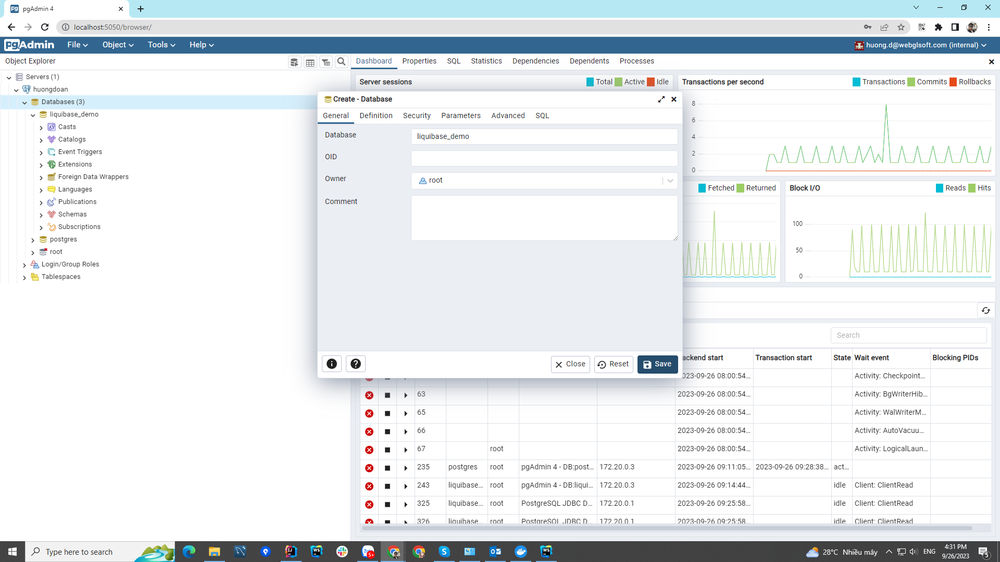

# liquibase-demo
# First, to run the program, make sure you have Docker Desktop installed and running it
# You can download Docker Desktop here: https://www.docker.com/products/docker-desktop/
# Then perform the following steps:
1. Step 1: Standing at the root directory of the project, move to the environment/liquibase-demo directory by executing the command "cd user-service/src/main/resources/environment/liquibase-demo" in command-line
2. Step 2: Executing the command "docker compose up -d" in command-line
3. Step 3: Access to "http://localhost:5050" in your browser and login to Pgadmin4 by email "huong.d@webglsoft.com" and password "123"
4. Step 4: After successfully logging in, click on "Add New Server"
5. Step 5: 
   - In General tab, enter your name in Name field
   - In Connection tab, enter the following information:
     - Host name/address: db
     - Port: 5432
     - Maintenance database: postgres
     - Username: root
     - Password: 123
6. Step 6: After successfully creating server with your name, let create database "liquibase_demo"

7. Step 7: Standing at the user-service directory of the project, executing the command "./gradlew bootRun" in command-line to run the Spring boot project
8. Step 8: After successful step 7, you can see API documents has been opened, if not, please access API documents at "http://localhost:8080/docs/swagger-ui/index.html" in your browser.
9. Step 9: Standing at the user-service directory of the project, executing the command "./gradlew test" in command-line to run test for the Spring boot project
10. Step 10: Standing at the personal-information-webapp directory of the project, executing the command "npm run dev" in command-line
11. Step 11: If you have followed the steps above but are not successful, please contact me at email address "huong.d@webglsoft.com"

